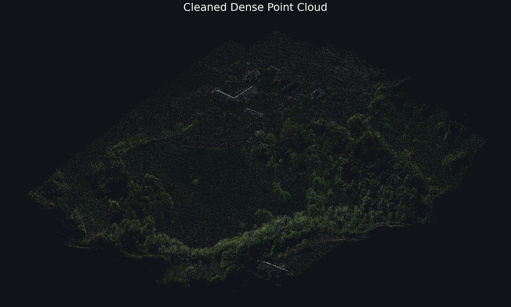
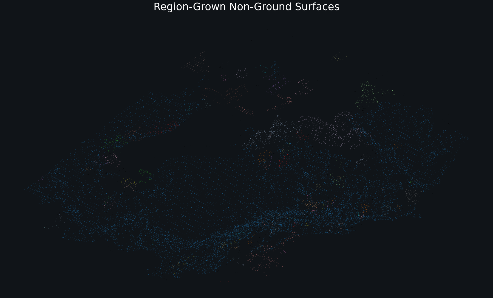
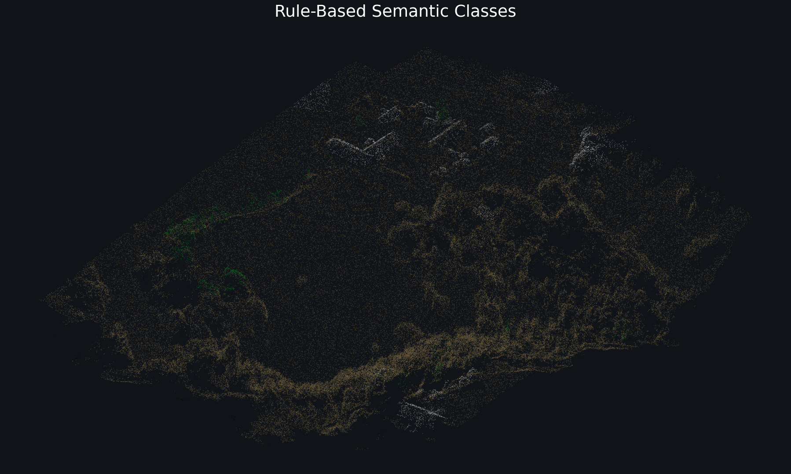

# DroneTwin 3D Mapping Pipeline

This project builds a 3D digital twin from overlapping drone imagery using
COLMAP, Open3D, and transparent geometry-based point-cloud processing.

The pipeline is designed to stay clean and inspectable:

```text
drone images
  -> COLMAP dense reconstruction
  -> point-cloud cleanup
  -> spatial analysis
  -> ground / non-ground split
  -> non-ground surface regions
  -> coarse semantic classes
```

## Pipeline

For a full rebuild from raw overlapping images in `data\raw`, run COLMAP first:

```powershell
conda run -n drone-twin python scripts\run_colmap.py
```

Then run the Open3D post-processing stages:

```powershell
conda run -n drone-twin python scripts\clean_point_cloud.py
conda run -n drone-twin python scripts\analyze_point_cloud.py
conda run -n drone-twin python scripts\segment_point_cloud.py
conda run -n drone-twin python scripts\region_grow_non_ground.py --proxy-output default
conda run -n drone-twin python scripts\classify_regions.py --view
```

`segment_point_cloud.py` writes:

```text
data\processed\dense\ground.ply
data\processed\dense\non_ground.ply
```

`region_grow_non_ground.py` writes:

```text
data\processed\dense\non_ground_regions.ply
data\processed\dense\non_ground_regions_proxy.ply
data\processed\dense\non_ground_region_labels.npz
```

`classify_regions.py` writes:

```text
data\processed\dense\semantic_classes.ply
data\processed\dense\non_ground_semantic_classes.ply
data\processed\dense\region_class_report.csv
data\processed\dense\semantic_class_legend.csv
```

## Results Preview

The repository does not commit raw imagery or generated point-cloud artifacts.
These PNG previews are rendered from local pipeline outputs:

Cleaned dense point cloud:



Region-grown non-ground surfaces:



Rule-based semantic classes:



Regenerate the previews after rerunning the pipeline:

```powershell
conda run -n drone-twin python scripts\render_readme_previews.py
```

## How It Works

The pipeline is geometry-first, not ML-first. Each script writes an inspectable
artifact so the next stage can be checked visually before trusting later labels.

- `run_colmap.py` reconstructs the scene from overlapping drone images. COLMAP
  extracts image features, matches them across neighboring photos, estimates
  camera poses, builds a sparse model, computes dense depth maps, and fuses
  those depth maps into a dense PLY point cloud.
- `clean_point_cloud.py` removes isolated reconstruction noise and optionally
  downsamples the cloud. Statistical filtering removes points whose neighbor
  distances are unusually large; voxel downsampling keeps one representative
  point per small 3D grid cell.
- `analyze_point_cloud.py` prints scene dimensions, height statistics, and
  nearest-neighbor spacing. The spacing is useful because later thresholds need
  to scale with the density of the current reconstruction.
- `segment_point_cloud.py` uses RANSAC to fit the dominant plane in the cleaned
  cloud. Points close to that plane become `ground.ply`; everything else becomes
  `non_ground.ply`.
- `region_grow_non_ground.py` groups non-ground points into connected surface
  patches. It works on a voxel proxy, estimates normals and height above the
  ground plane, connects nearby voxels with similar surface direction and small
  height jumps, then transfers labels back to the full-resolution cloud.
- `classify_regions.py` assigns coarse classes with transparent rules. It
  computes region features such as roughness, planarity, height variation,
  footprint fill, aspect ratio, and horizontalness, then scores each region as
  ground, tree, building, water, or other.

## Semantic Classes

The semantic classifier is intentionally rule-based and inspectable. It computes
simple region features, scores each class, then applies dominance multipliers:

```powershell
conda run -n drone-twin python scripts\classify_regions.py --view `
  --ground-dominance 1.0 `
  --tree-dominance 1.8 `
  --building-dominance 1.0 `
  --other-dominance 0.6
```

Water classification is disabled by default because the current scene does not
contain water. Enable it explicitly only for datasets where water is expected:

```powershell
conda run -n drone-twin python scripts\classify_regions.py --enable-water --view
```

## Repository Structure

```text
scripts/
  run_colmap.py              # COLMAP reconstruction wrapper
  clean_point_cloud.py       # cleanup and downsampling
  analyze_point_cloud.py     # basic spatial statistics and visualization
  segment_point_cloud.py     # ground / non-ground split
  region_grow_non_ground.py  # surface-region extraction
  classify_regions.py        # coarse semantic classification
  render_readme_previews.py   # static preview image renderer

data/
  raw/                       # source imagery, not committed
  processed/                 # generated point clouds/results, not committed

docs/
  images/                    # committed README preview images
```

## Setup

Create the environment:

```powershell
conda create -n drone-twin python=3.10
conda activate drone-twin
pip install -r requirements.txt
```

COLMAP should be installed separately and available from the command line.

`run_colmap.py` looks for COLMAP in this order:

1. `--colmap C:\path\to\COLMAP.bat`
2. `DRONETWIN_COLMAP`
3. `colmap` on `PATH`
4. `C:\Tools\COLMAP\COLMAP.bat` if present on this machine
